# 항해 백엔드 플러스 과제: Concert Reservation
---
## 문제 해결 Docs

### [1. 동시성 처리](document/consistency-problem.md)
 - 락: Pros & Cons
 - UseCase 분석
 - UseCase 별 동시성 처리 전략

### [2. Caching](document/caching.md)
 - 쿼리 분석
 - Caching 전략 수립
 - Caching 적용
 - 개선할 점

### [3. Redis를 이용한 대기열 구현](document/queue-with-redis.md)
 - Redis 데이터 타입 및 구현 방법 설계
 - 대기열을 이용한 Transactions 관리

### [4. DB Indexing](document/db-index.md)
 - Intro. RDB에서 DB Indexing이란?
 - 쿼리 분석 및 전략 수립
 - 조회 성능 테스트
 - Conclusion

### [5. 서비스 확장, 트랜잭션 및 Event Driven](document/business-transaction-develop.md)
 - 현재 트랜잭션 분석
 - Event를 이용한 결제 트랜잭션 분리
 - 서비스 확장
 - 설계

### [6. 부하테스트](document/load-test.md)
### [7. ]

---

## 요구사항 분석 (Sequence Diagram)
### 토큰 발급 API
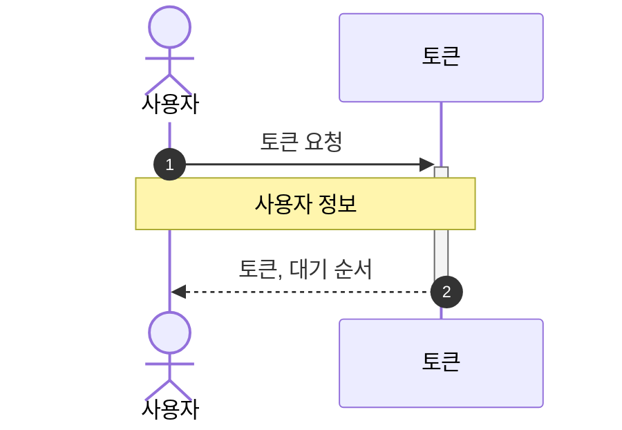

### 콘서트 조회 API
> 대기열 검증 필요
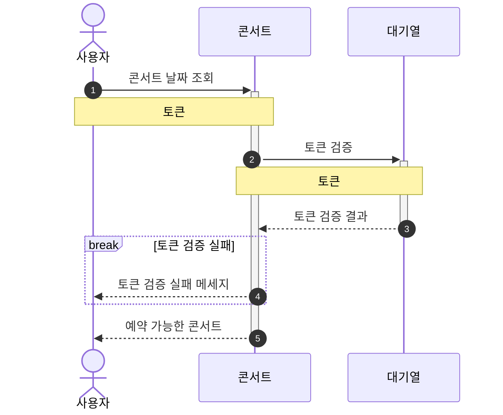

### 콘서트 날짜 조회 API
> 대기열 검증 필요
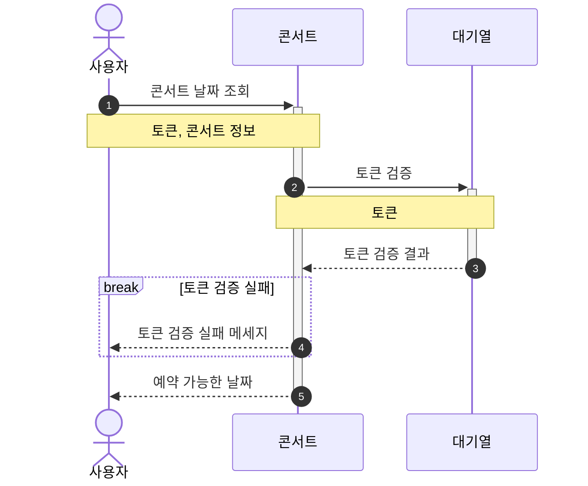

### 콘서트 좌석 조회 API
> 대기열 검증 필요
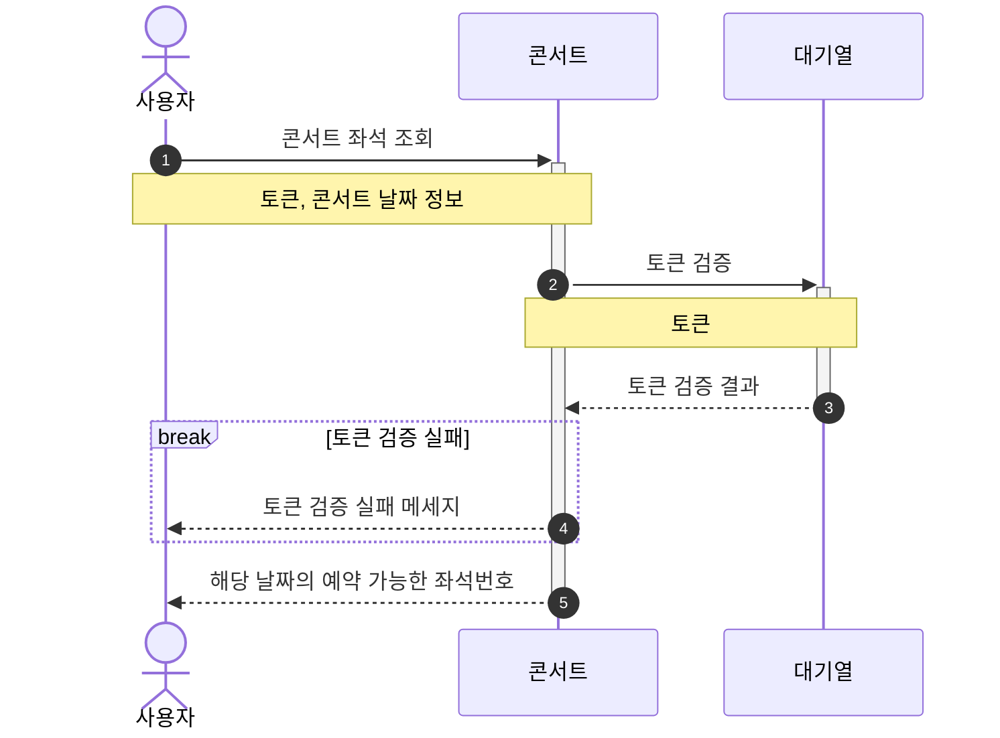

### 콘서트 좌석 예약 API
> 대기열 검증 필요
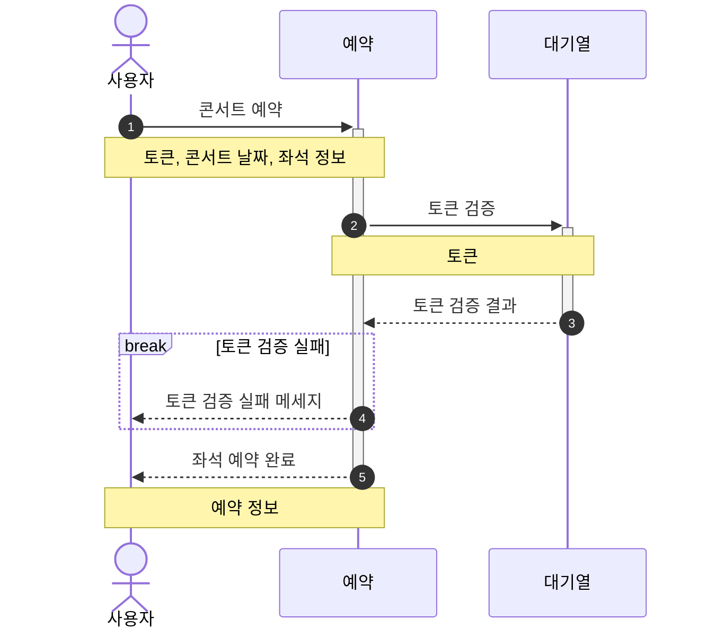

### 잔액 조회 API

### 잔액 충전 API
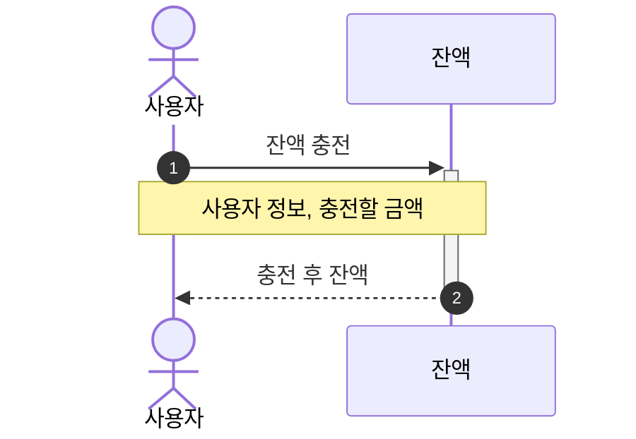

### 결제 API
> 대기열 검증 필요
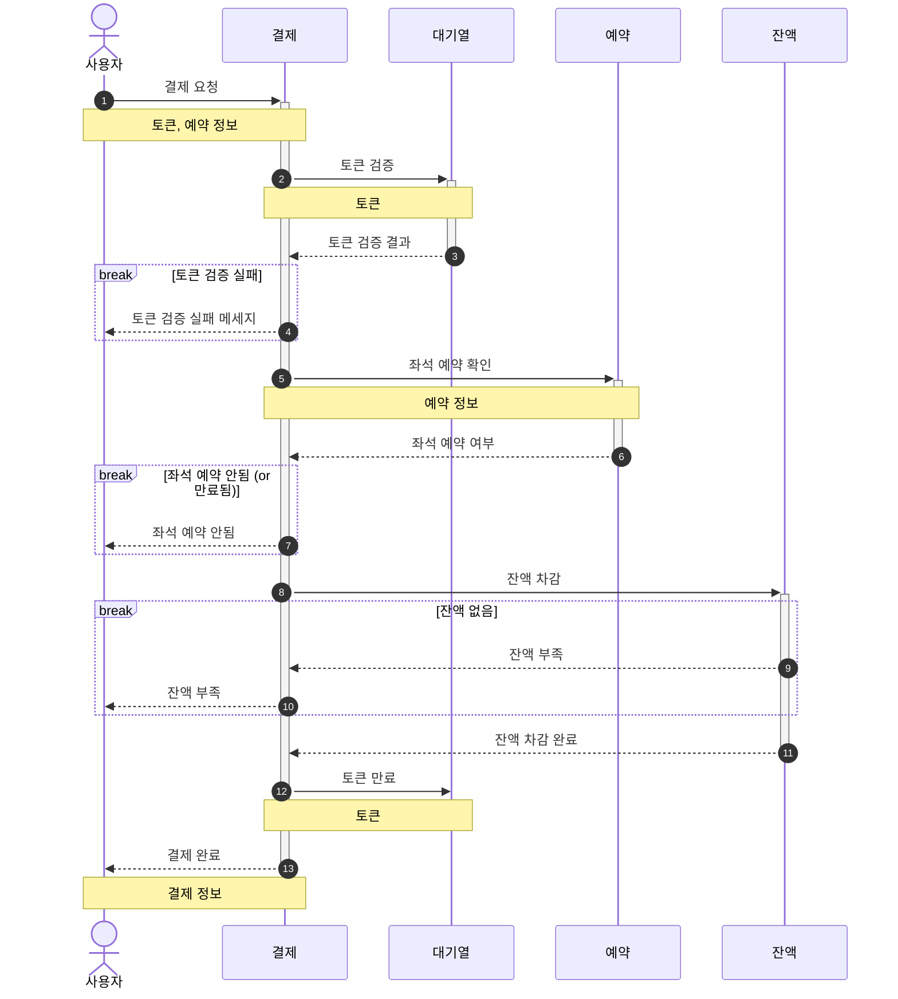

### 상태 확인 및 상태값 변경
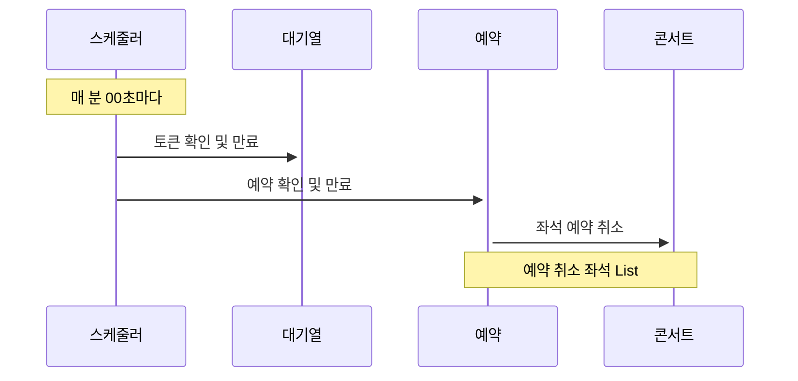
## Milestone
### Tasks
- 설계
    - 요구사항 분석
    - ERD 설계
    - API 명세 작성 및 MockAPI 구현
- 대기열
    - 토큰 발급
    - 토큰 만료 스케줄러
- 콘서트
    - 콘서트 날짜/좌석 조회 API
- 예약
    - 좌석 예약 API
- 결제
    - 잔액 조회/충전 API
    - 결제 API
- 배포
    - 배포 환경 설정 및 테스트

### Gantt Chart

- 3주차
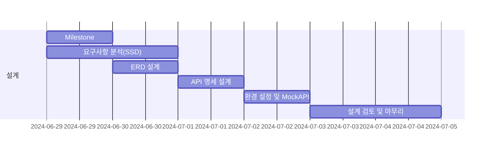

 - 4주차
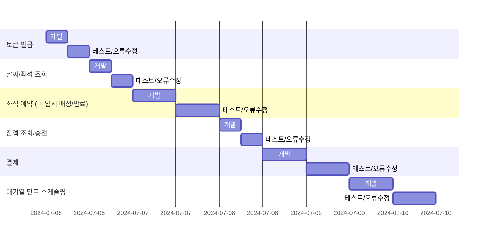

 - 5주차
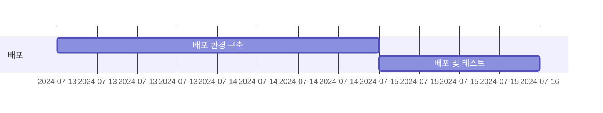
## ERD
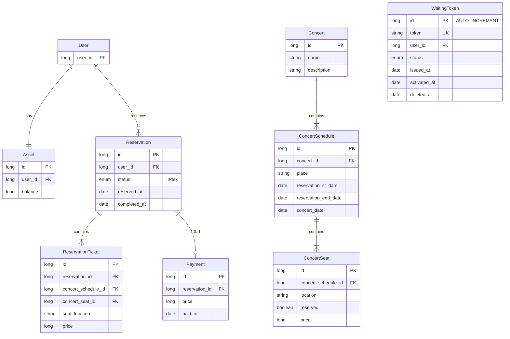
## API 명세
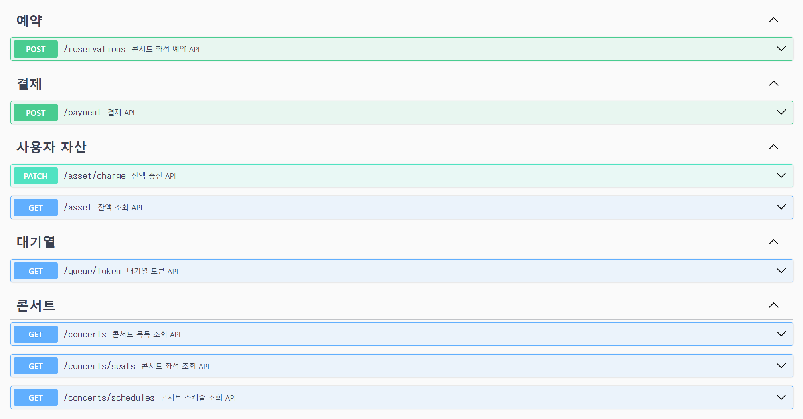
