# 항해 백엔드 플러스 과제 Chapter2. Concert Reservation

---
# Caching

## 쿼리 분석
### 콘서트 조회
콘서트의 메타 정보(제목, 상세 내용)를 조회
### Caching이 필요한가?
 - 일반적인 조회에서는 필요하지 않다.
 - **Concert의 양이 매우 많아져서 Paging**이 필요해진다면 필요할 것!
 - 추가로 **주요 Concert, 다가오는 Concert** 등 Concert에 대한 Priority를 부여하거나, 잔여 좌석 조회 등 쿼리가 복잡해진다면 필요해 질 것!

### Caching 전략 수립
1. Eviction vs Expiration: **Expiration**
   - **Eviction**: 콘서트의 정보가 변경될 때마다 콘서트 관련 모든 Cache를 삭제
   - **Expiration**: 특정 주기(ex. 10초)마다 콘서트 정보가 만료됨
   - **콘서트의 경우 Expiration 주기 동안에 발생하는 Data 정합성 문제가 치명적이지 않을 것이라 판단됨**  

2. 정말 즉각적인 Update가 필요한 경우는...? **선택적으로 Eviction 처리**
   - 특정 상황에서 치명적 오류 데이터 수정 혹은 좌석 만료 표시 등 즉각적인 데이터 Update가 필요한 경우가 있다.
   - 이럴 때 Caching으로 인해 즉각적으로 정보가 반영되지 않는다면 큰 문제를 야기할 수 있음.
   - **특정 API에서만 Eviction이 일어나도록 설정**

3. Paging에서 데이터 크기 문제
   - Page가 많아질 수록 과하게 많은 데이터가 Cache에 적재될 수 있음
   - 뒤 쪽 페이지일 수록 Hit Rate는 낮아질 것
   - Offset Paging을 이용할 때는 뒤 쪽 페이지일 수록 Caching 효율이 좋음 (뒤 페이지일 수록 SQL 조회 속도가 느려짐)

### Paging: Caching 적용
 - Concert 1000건을 이용하여 100개씩 Offset Paging하도록 설정 후 8페이지에 대해서 100번 조회할 때 성능 비교
 - **Caching 전략**
   - 즉각적인 반영이 중요하지 않아 Expiration 적용
   - ttl의 경우 길 수록 Heat Rate에 유리하지만, Paging 특성상 너무 길어지게 되면 Cache데이터 크기가 너무 커질 수 있음.
   - 10초 ~ 30초로 설정하는 것이 적당하다고 판단하여 20초로 구현
 - 결과
   - Cache X: 2.092초
   - 
   - Cache O: 1.52초
   - 
 
### 개선해보고 싶은 점
 - Paging에서 Heat Rate가 낮은 Cache에 대해서는 ttl을 낮게 가져가서 페이지 낭비를 줄이는 방법을 생각해보면 좋을 것 같다
   - Ex. Default는 10초 / Heat될 때 마다 갱신하여 최대 30초까지될 수 있게...?
 - Offset Paging이 아니라 Cursor Paging으로 변경하고 앞 페이지 일부에만 Caching을 적용하는 것도 방법이라고 생각된다.
 - 주요 Concert 조회/ 잔여좌석 조회 등 복잡한 쿼리에 대한 결과도 확인하고 싶다.

---
# Redis를 이용한 대기열 구현
## 데이터 타입 및 구현 방법
  - Set
    - Member 여러개를 보관
    - 간단하게 구현 가능.
  - Sorted Set 
    - Member들을 Score 값에 따라 순서를 맞춰서 저장. 
    - RANGE로 특정 구간의 Member를 조회하기 편함
    - RANK로 특정 Member의 위치를 찾기 편함
  - Hashe
    - Member를 Key-Value 형태로 저장할 수 있음
    - TTL을 설정할 수 있음.
    - Spring Data Redis / RedisRepository로 Java 객체 형태로 구현 가능
    - @Indexed를 통해 Indexing 가능 (Redis에는 Set형태로 Index를 관리하는 것으로 보임)

### 활성 토큰
#### Q1. 어떤 데이터 타입으로 어떻게 구현?
  - token과 userId를 통한 조회와 TTL이 필요하므로 **Redis Hashe**를 사용
  - Redis Hashe를 구현하기에 적합한 **Spring Data Redis와 Redis Repository**를 이용하여 구현

### 대기열 토큰
#### Q1. 어떤 데이터 타입으로 어떻게 구현? 
  - TTL은 필요하지 않지만 Token/UserId를 통한 조회를 위해 **Redis Hashe 및 Spring Data Redis**를 사용
#### Q2. RANK나 RANGE를 이용한 조회는...?
  - Hashe에 추가로 Sorted Set를 구현.
  - 대기열에 Token이 추가될 때 Sorted Set에 Member:토큰, Score: 접속시간 형태로 SortedSet에 같이 저장하여 RANK와 RANGE를 사용할 수 있도록 설정

## 대기열 Transaction 관리
### 특정 시간당 전환하는 Token 관리
1. 1명의 User가 예약을 끝내는 데에 필요한 Transaction수는?? 6 Transactions
  - 콘서트 조회 -> 콘서트 스케줄 조회 -> 좌석 조회 -> 예약 -> 결제
  - 최소 5개 & 일부 실패에 의한 Retry를 고려하여 6 Transaction으로 예상
2. 서버가 감당할 수 있는 Trasactions/1min은?? 1800Transactions/1min
  - 부하테스트를 통해 얻는 것이 정확하지만...!
  - 인터파크의 경우 1명의 유저가 좌석 구역 선택 -> 좌석 선택 -> 예약 3개의 Transaction을 발생시키고, 1초에 200명 정도 수용하는 것으로 예상됨
  - 인터파크는 3 * 10 * 60 = 1800/1min의 Transaction을 감당하는 것으로 예상
3. 그럼 우리 서버가 시간 당 들여보낼 User 수는??
  - 1800transactions/1min -> 600users/1min -> 100users/10secs
  - 1초에 100명을 들여보내면 될 것으로 생각되어 구현

### 추가로 고려해야할 사항
1. 항상 Transactions/User 와 User의 예약 시간이 동일하게 유지될까??
  - 초반에는 좌석이 많아서 충돌도 적고, 빠르게 유저가 예약하고 나갈 수 있다.
  - 하지만 뒤로갈 수록 좌석에 대한 경쟁이 심해지고, 충돌 발생 수가 증가할 것으로 예상된다
  - 잦은 충돌로 인해 Transaction/User가 증가할 수도 있고, 예약 시간 자체도 증가할 것으로 생각된다.
  - 1분당 1 유저가 발생시키는 Transaction이 증가하지 않는다면, Threshold를 두어 내부 유저수를 제한하는 것도 방법
  - Threshold를 3000 User로 설정하고 이를 넘어갈 경우 토큰을 전환하지 않는다.

### 개선할 사항
1. Threshold를 좀더 효과적으로 관리할 수 있는 방법은 없을 까...?
  - 뒤로갈 수록 충돌도 많아지고, 예약시간이 증가하는 것도 맞지만, Dead User(아무것도 하지 않는 유저)도 많아질 것으로 생각된다.
  - 초반에 순환이 잘 일어날 때는 Threshold를 낮게 잡고 시작하지만, 후반에는 Threshold가 점점 증가하는 방식으로 진행해도 괜찮을 것같다.
2. 동시성 문제
  - 은행창구 방식에서는 발생하지 않지만, 놀이공원 방식의 경우 여러개의 Application에서 Scheduler가 동작한다면 동시성 문제가 발생할 것이다.
    - (ex. 100users/10secs를 의도했지만 scheduler가 10개일 경우 1000users/10secs가 활성화될 것)
  - 1안. Scheduler를 다른 Application으로 구현하여 반드시 1개의 Scheduler만 동작하도록 설정
  - 2안. Redis를 통해 token scheduled time을 관리 (lock 이용해서 동시성 처리). 해당 시간이 10초가 지나지 않았으면 scheduling하지 않는다.
  - 2안보다는 1안이 좀 더 효율적으로 보인다.

---

## 동시성 처리
### 1. LOCK: Pros & Cons
| | 특징                                                                                                 | Pros                           | Cons                                                 |
|---|----------------------------------------------------------------------------------------------------|--------------------------------|------------------------------------------------------|
|낙관락| **Update할 때 Version 확인**  조회 시점과 Update 시점의 Version이 다르면 Update 실패                              | 다른 Transaction에 영향을 주지 않음      | 트래픽이 몰릴 때 성능이 크게 하락  (Retry 정책을 이용할 시)            |
|비관락| **Select할 때 Lock 설정. Transaction이 끝나면 Lock 해제**  다른 Transaction이 Lock을 걸려면 이전 Lock이 해제될 때 까지 대기 | 전부 DB에서 처리하므로 높은 성능            | Transaction이 대기하므로, DB에 부하 증가                        
|분산락| **DB외에 Lock을 위한 Resource를 추가**  Redis/Kafka 등에서 Lock을 따로 관리                                     | DB 부하 감소   Lock을 자유롭게 이용 가능 | 1. Lock 관리를 위한 추가 Resource 필요   2. 코드 복잡도 증가   |

### 2. UseCase
#### 대기열
  - 토큰 발급
  - ~~토큰 검증 (Interceptor)~~ > 동시성 이슈 X
  - 토큰 만료/활성화 (Scheduler)
#### 콘서트
  - ~~콘서트/스케줄/좌석 조회~~ > 동시성 이슈 X
  - 좌석 예약 만료 (Scheduler)
### 예약
  - 콘서트 좌석 예약
#### 결제
  - 결제
#### 사용자
  - ~~자산 조회~~ > 동시성 이슈 X
  - 자산 충전

### 3. UseCase 분석
#### 토큰 발급
 - Transaction 범위 : 최소 범위 (JPA)
 - 동시성 문제: User 한 명에 여러개의 대기열 토큰 발급 
 - 해결 방법: Unique Constraint (userId, status)
 - 이유: 
   - LOCK 구현 없이 해결 가능

#### 토큰 만료/활성화
 - Transaction 범위 : 최소 범위 (JPA)
 - 동시성 문제: 동시에 조회 -> Update로 인해 Lost Update 발생
 - 동시성 해결: 조치 X
 - 이유: 
   - 비지니스 로직 상 Lost Update가 발생해도 문제가 없음
   - 모두 같은 결과를 예상하기 때문에

#### 좌석 예약 만료/활성화
- Transaction 범위 : 최소 범위 (JPA)
- 동시성 문제: 동시에 조회 -> Update로 인해 Lost Update 발생
- 동시성 해결: 조치 X
- 이유:
  - 비지니스 로직 상 Lost Update가 발생해도 문제가 없음
  - 모두 같은 결과를 예상하기 때문에

#### 콘서트 좌석 예약
- Transaction 범위: Service 함수
- 동시성 문제: 하나의 좌석에 대한 여러개의 예약 발생
- 동시성 해결: 분산락
- 이유:
  - 동시성 이슈가 발생했을 때 대기할 필요 없음
  - 분산락: 락 획득 시도 후 실패시 DB Connection 없이 종료 가능

#### 결제
- Transaction 범위: Facade 함수
- 동시성 문제: 금액 차감에서 Lost Update 발생 & 하나의 예약에 대한 다수의 결제 발생
- 동시성 해결: 비관적 락
- 이유:
  - 낙관락은 성능 이슈가 발생할 수 있음
  - DB에 부하를 발생시킬 정도의 동시성 이슈가 예상되지 않음

#### 잔액 충전
- Transaction 범위: Service 함수
- 동시성 문제: 잔액 충전 시 Lost Update 발생
- 동시성 해결: 비관적 락
- 이유:
  - 낙관락은 성능 이슈가 발생할 수 있음
  - DB에 부하를 발생시킬 정도의 동시성 이슈가 예상되지 않음
  - History 를 이용한 해결 방법: 조회 성능이 매우 떨어질 수 있음

---
## 요구사항 분석 (Sequence Diagram)
### 토큰 발급 API
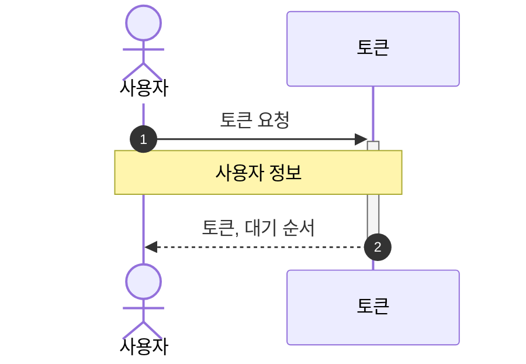

### 콘서트 조회 API
> 대기열 검증 필요
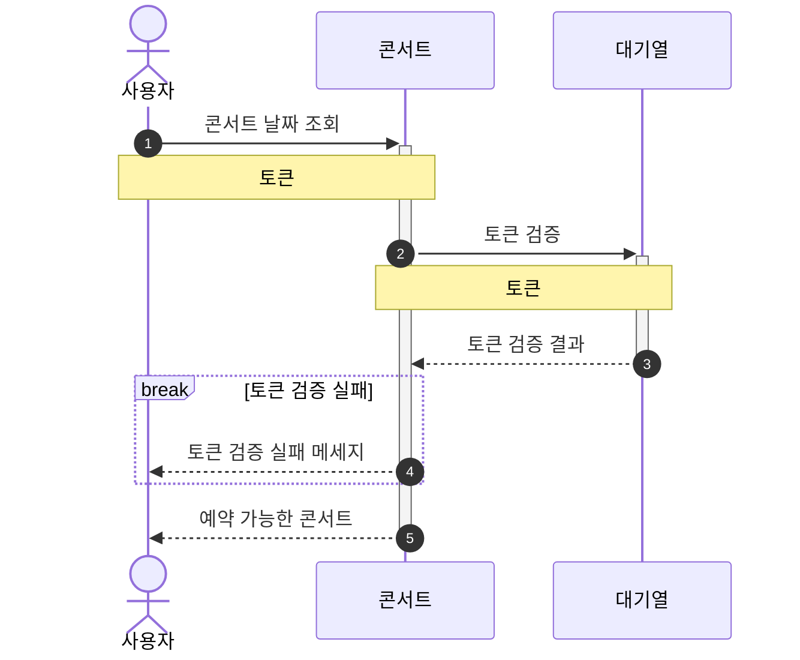

### 콘서트 날짜 조회 API
> 대기열 검증 필요
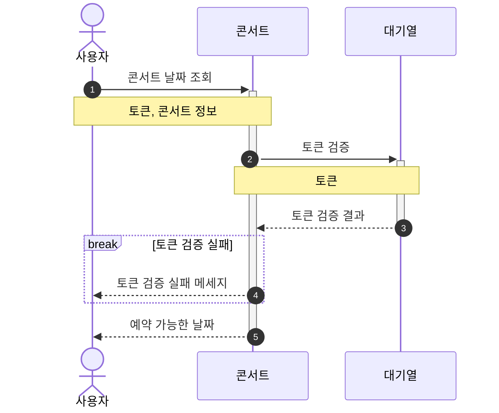

### 콘서트 좌석 조회 API
> 대기열 검증 필요
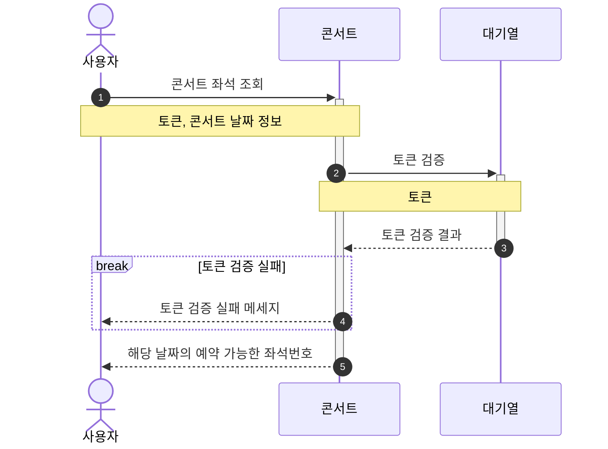

### 콘서트 좌석 예약 API
> 대기열 검증 필요
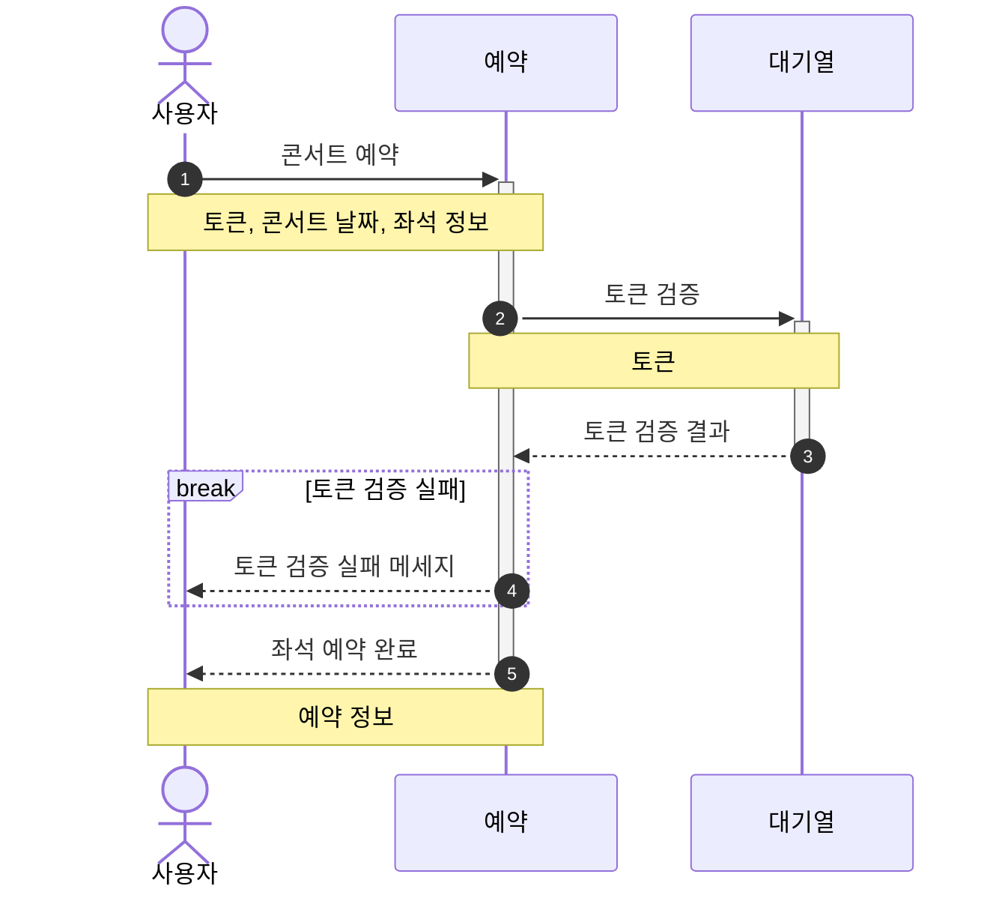

### 잔액 조회 API

### 잔액 충전 API
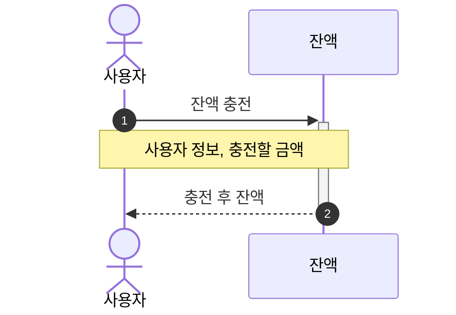

### 결제 API
> 대기열 검증 필요
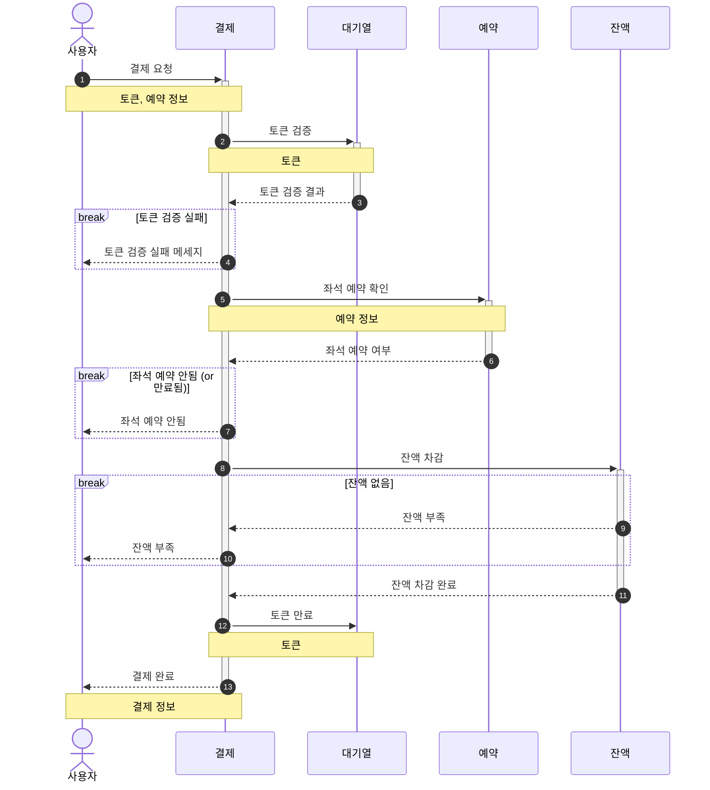

### 상태 확인 및 상태값 변경
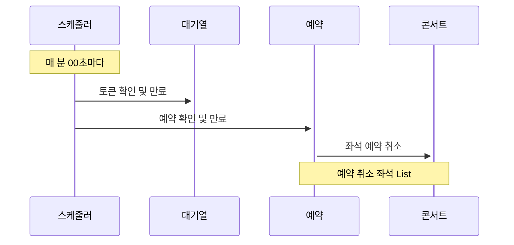
## Milestone
### Tasks
- 설계
    - 요구사항 분석
    - ERD 설계
    - API 명세 작성 및 MockAPI 구현
- 대기열
    - 토큰 발급
    - 토큰 만료 스케줄러
- 콘서트
    - 콘서트 날짜/좌석 조회 API
- 예약
    - 좌석 예약 API
- 결제
    - 잔액 조회/충전 API
    - 결제 API
- 배포
    - 배포 환경 설정 및 테스트

### Gantt Chart

- 3주차
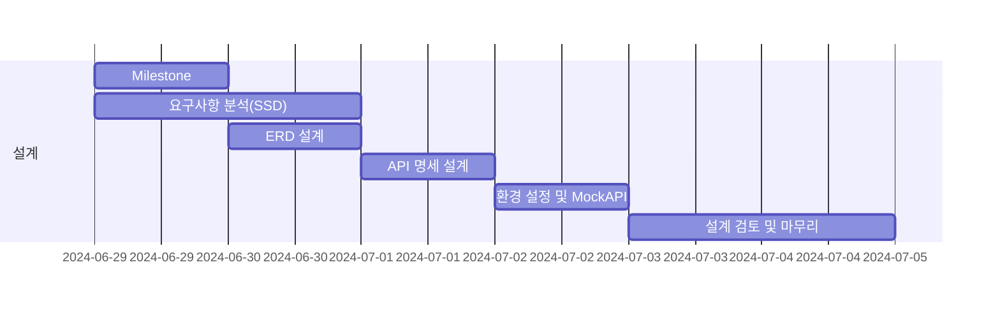

 - 4주차
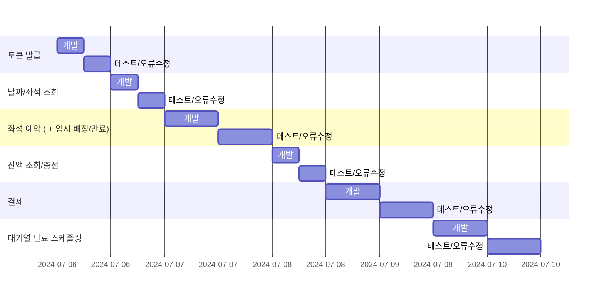

 - 5주차
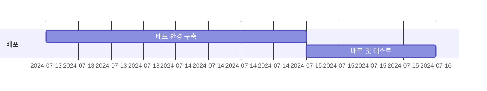
## ERD
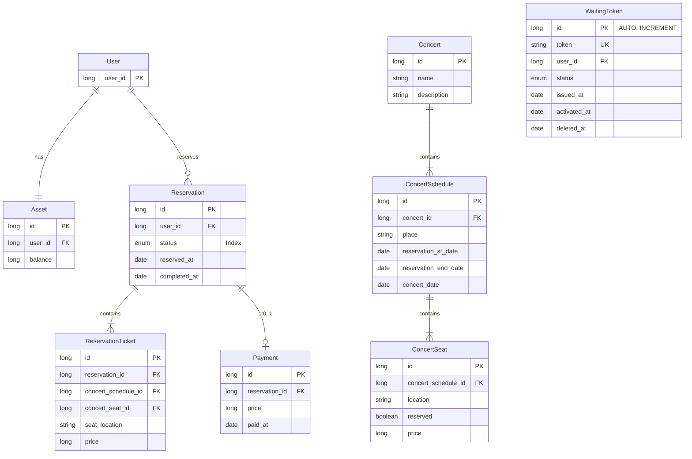
## API 명세

