# 항해 백엔드 플러스 과제 Chapter2. Concert Reservation
## 요구사항 분석 (Sequence Diagram)
### 토큰 발급 API
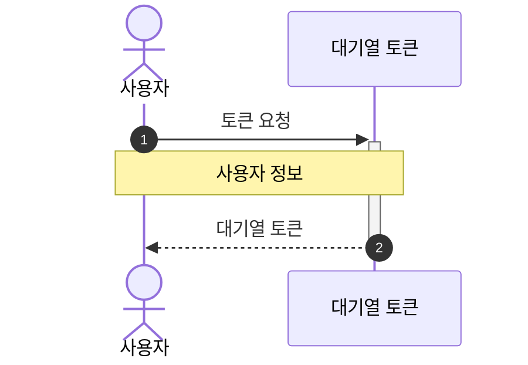
### 대기열 Polling API
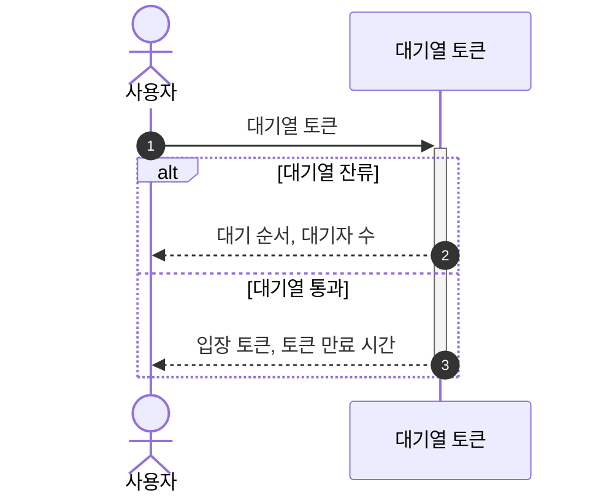
### 콘서트 조회 API
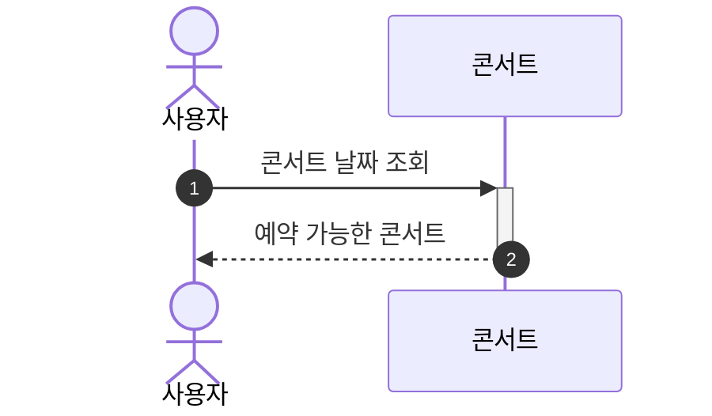

### 콘서트 날짜 조회 API
> 대기열 검증 필요
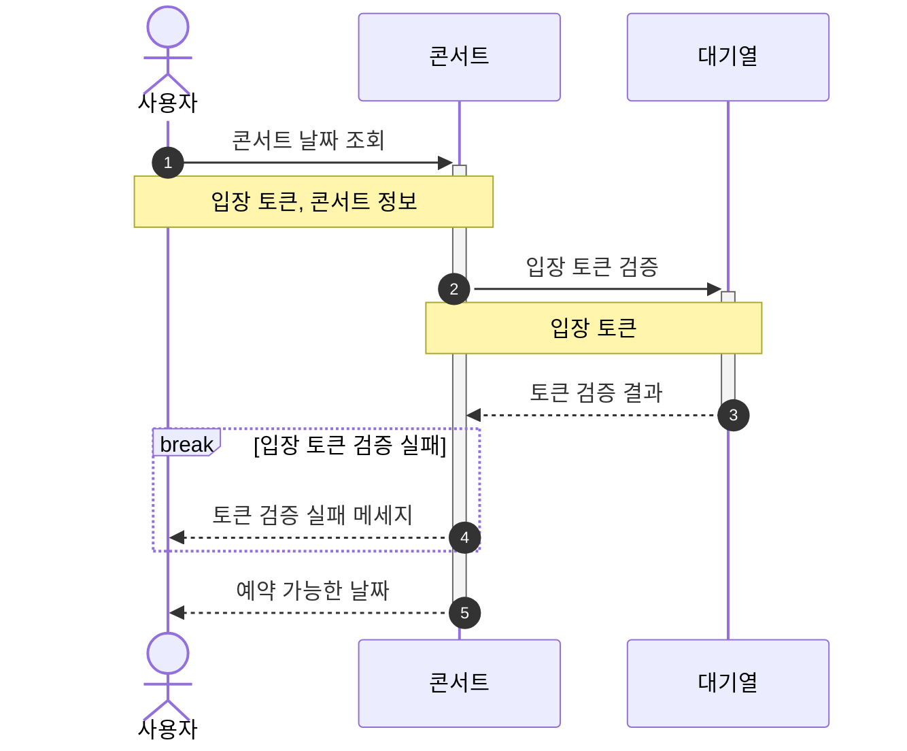

### 콘서트 좌석 조회 API
> 대기열 검증 필요
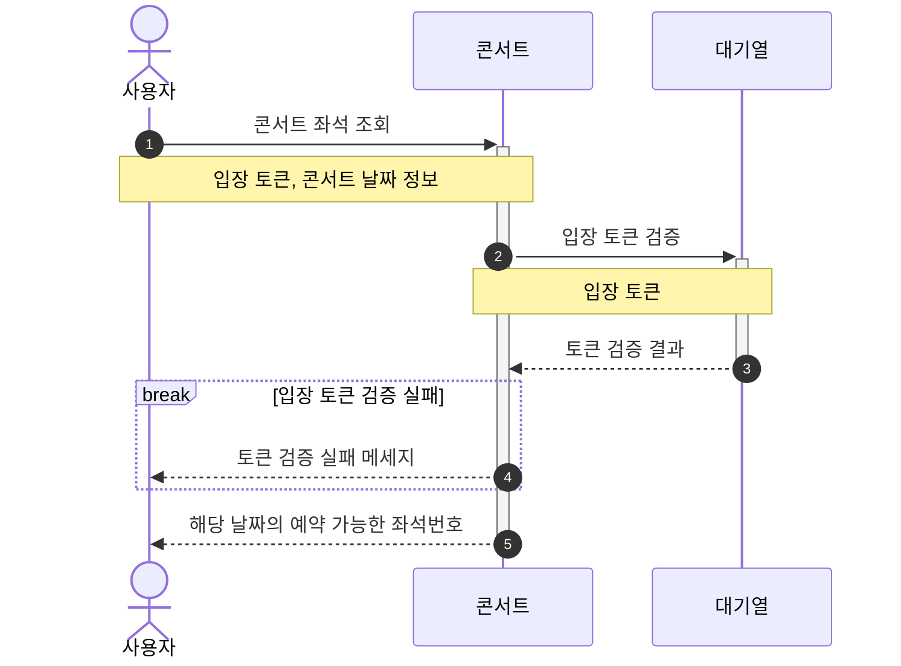

### 콘서트 좌석 예약 API
> 대기열 검증 필요
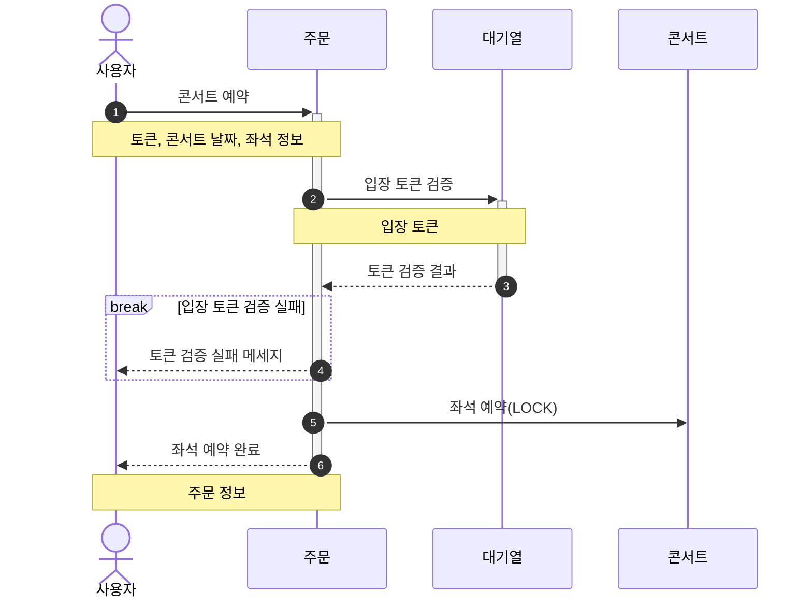

### 잔액 조회 API

### 잔액 충전 API
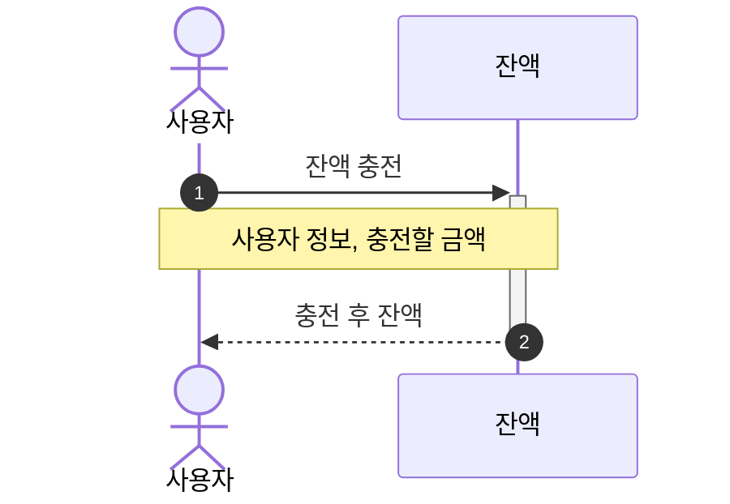

### 결제 API
> 대기열 검증 필요
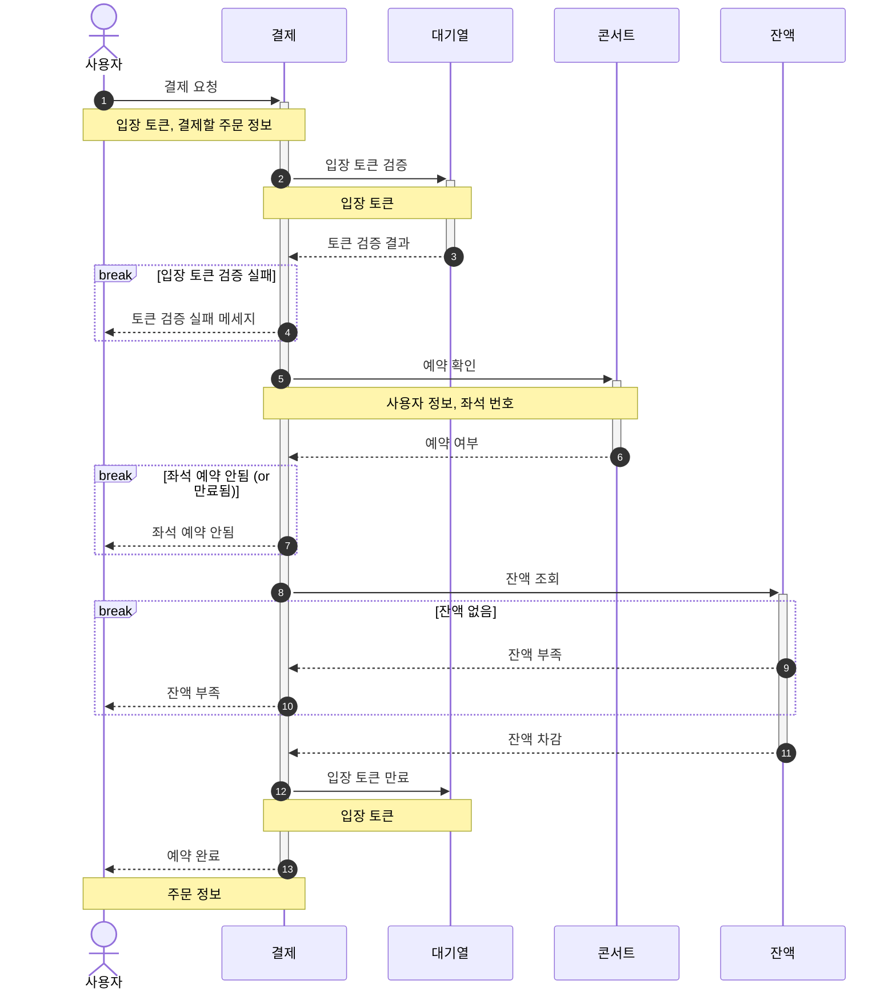

### 상태 확인 및 상태값 변경
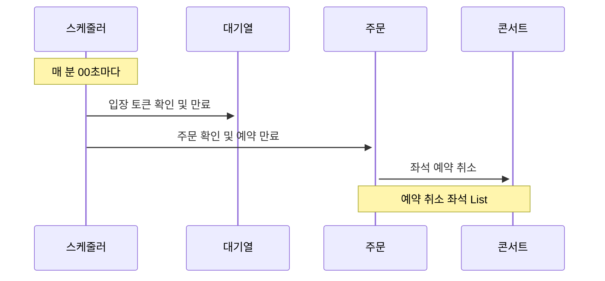
## Milestone
### Tasks
- 설계
    - 요구사항 분석
    - ERD 설계
    - API 명세 작성 및 MockAPI 구현
- 대기열
    - 토큰 발급
    - 대기열 Polling API
    - 대기열 토큰 검증
- 콘서트
    - 콘서트 날짜/좌석 조회 API
- 주문
    - 좌석 예약 API
    - 잔액 조회/충전 API
    - 결제 API
- 배포
    - 배포 환경 설정 및 테스트

### Gantt Chart

- 3주차
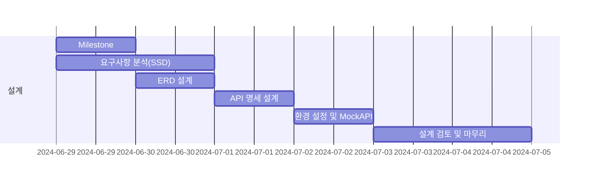

 - 4주차
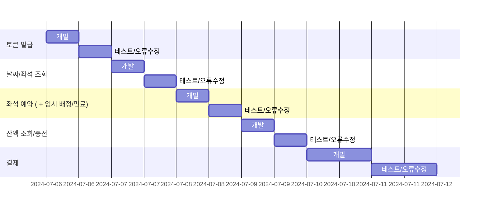

 - 5주차
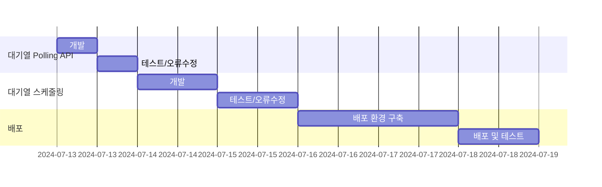
