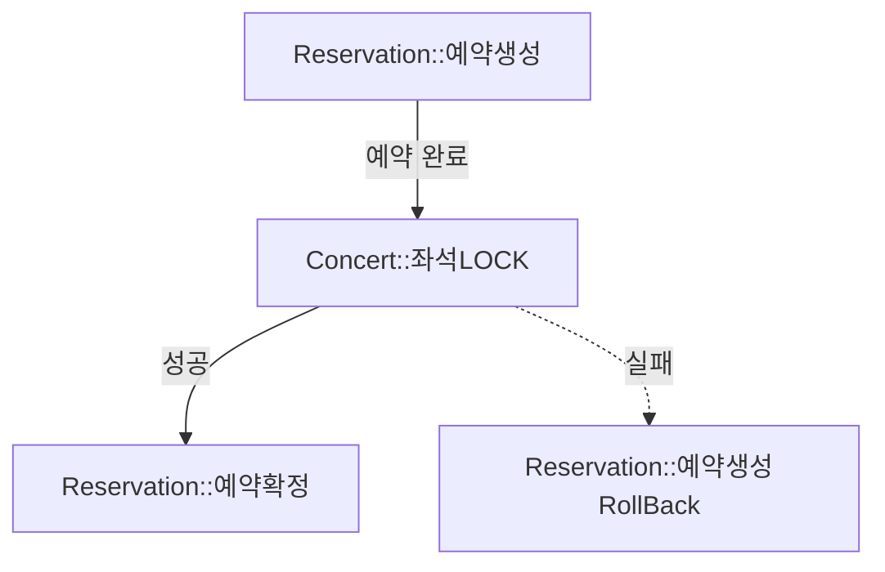
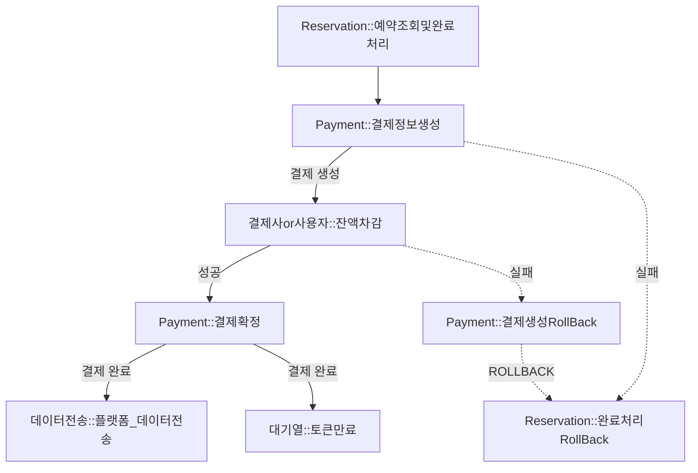

# 서비스 확장과 Transaction 범위
## 1. 현재 Transactions 분석
### 1.1 잔액 충전/사용
```
Tx(잔액 충전/사용) {
    잔액 조회() - 비관적 LOCK
    작앤 충전/사용()
}
```
- 비관적 LOCK을 위한 Transaction으로, 원자성이 필요하지는 않은 로직이다.

### 1.2 예약
```
Tx(예약) {
    예약 생성()
    좌석 상태 변경()
}
```
- `예약 생성`과 `좌석 상태 변경`은 반드시 원자성이 보장되어야 한다.
- 둘 중 하나라도 실패하면 `롤백`해야한다.
- `콘서트`와 `예약`을 분리하게 된다면 원자성을 보장하기 위한 전략이 필요해 보인다.

### 1.3 결제
```
Tx(결제) {
    잔액 사용()
    결제 생성()
    예약 완료 처리()
    토큰 만료()
    데이터 플랫폼 전송()
}
```
- `잔액 사용`, `결제 생성`, `예약 완료 처리` 3개는 원자성이 보장되어야할 것으로 보인다.
- `데이터 플랫폼 전송`의 경우 외부 API에 영향을 받기때문에 트랜잭션에서 분리시키는 것이 좋아보인다.
- `토큰 만료` 또한 결제 트랜잭션에서 원자성이 보장되어야할 기능은 아닌 것으로 생각되어 결제 트랜잭션에서 분리시키는 것이 좋아 보인다.
- `사용자`, `결제`, `예약` 도메인들이 분리되게 된다면, 원자성을 보장하기 위한 전략이 필요해 보인다.

### 1.4 토큰 활성화
```
Tx(토큰 활성화) {
    대기열에서 토큰 삭제()
    활성화 토큰에 추가()
}
```
- `대기열에서 토큰 삭제`와 `활성화 토큰에 추가`는 반드시 원자성이 보장되어야 한다.
- 둘 중 하나라도 실패하면 `롤백`되도록 설정해야 할 것이다.
- 하지만 둘 다 `대기열`도메인에 속하므로, 해당 트랜잭션이 분리될 일은 없을 것으로 생각된다.

## 2. Event를 이용한 결제 트랜잭션 분리
> ※ 외부 Data Send Client 테스트를 위한 `DatasendApiClientImpl.java`
> ```java
> @Override
> public void sendPaymentInfo(Payment payment) throws InterruptedException {
>     Thread.sleep(2000L);
> }
> ```
### Before
```java
@Transactional
public PaymentDto placePayment(String token, long userId, long reservationId) {
    Reservation reservation = reservationService.getAndLockReservation(reservationId);

    userAssetService.useUserAsset(userId, reservation.getTotalPrice());
    Payment payment = paymentService.placePayment(reservation);
    reservationService.completeReservation(reservation);
    
    tokenService.expireToken(token);
    datasendService.sendPayment(payment);
    
    return new PaymentDto(payment);
}
```
> 2024-08-08 21:48:23 [Test worker] INFO  i.h.c.a.p.PaymentFacadeIntegTest - 트랜잭션 분리 전: 2048 ms
- datasendService의 2초 시간으로 인해 Transaction의 길이가 2초 넘게 길어지게 된다.
- `datasendService.sendPayment` 와 `tokenService.expireToken`이 하나의 트랜잭션으로 묶이면서 원자성에 포함되게 된다.
  - 둘 중 하나라도 Exception이 발생하면 불필요하게 전체 결제 로직이 RollBack 된다.

### After
```java
@Transactional
public PaymentDto placePayment(String token, long userId, long reservationId) {
    Reservation reservation = reservationService.getAndLockReservation(reservationId);

    userAssetService.useUserAsset(userId, reservation.getTotalPrice());
    Payment payment = paymentService.placePayment(reservation);
    reservationService.completeReservation(reservation);
    
    paymentService.paymentCompleted(token, payment);

    return new PaymentDto(payment);
}
```
> 2024-08-08 21:59:45 [Test worker] INFO  i.h.c.a.p.PaymentFacadeIntegTest - 트랜잭션 분리 후: 27 ms
- 외부 API에 영향을 받는 `datasendService.sendPayment`를 제거하여 트랜잭션 길이가 크게 줄어든 모습니다.
  - 기존: 2048ms -> 분리 후: 28ms
- `datasendService.sendPayment` 와 `tokenService.expireToken`기능을 제거하여 원자성에 영향을 주지 않도록 한다.
  - 이제는 두개의 기능이 정상 동작하지 않아도 `placePayment`기능은 정상적으로 동작한다.
- `paymentService.paymentCompleted`에서 `PaymentSuccessEvent`를 발생시켜 각 `datasend`와 `queue` 도메인이 알아서 Event를 Handle하도록 변경하였다.

```java
@Async @TransactionalEventListener(phase = TransactionPhase.AFTER_COMMIT)
void paymentSuccessEventHandler(PaymentSuccessEvent paymentSuccessEvent) {
    queueFacade.expireActiveToken(paymentSuccessEvent.token());
}
```
- 결제가 완료된 이후 토큰이 만료되어야 하고, 결제의 Transaction에 영향을 주지 않기 위해 `AFTER_COMMIT`정책을 이용한다.
- 결제의 `요청 Thread`에 영향을 주지않기 위해 `Asyc`로 동작하도록 한다.

```java
@Async @TransactionalEventListener(phase = TransactionPhase.AFTER_COMMIT)
void paymentSuccessEventHandler(PaymentSuccessEvent paymentSuccessEvent) {
    datasendFacade.sendPayment(paymentSuccessEvent.payment());
}
```
- 결제가 완료된 이후 데이터 전송이 되어야 하고, 결제의 Transaction에 영향을 주지 않기 위해 `AFTER_COMMIT`정책을 이용한다.
- 결제의 `요청 Thread`에 영향을 주지않기 위해 `Asyc`로 동작하도록 한다.


## 3.서비스 확장
> 서비스 분리
> - 서비스의 규모가 커지게 되면 각 서비스가 자신의 기능만 책임 지도록 설계하기 위해 서비스를 분리하는 것이 유리할 수 있다.
> - 또한 각 서비스에 맞게 Resource를 분배하여 더욱 효율적으로 Resource를 관리할 수 있다.

### 3.1 예약
#### 분리해야하나?!
- 예약이 콘서트 뿐 아니라 그 외 기타 영역으로 확장될 수 있다. (영화, 스포츠, 등등)

#### 발생할 수 있는 문제점
- 다양한 도메인의 예약도 처리할 수 있도록 `Meta Data`설계를 해야할 것으로 보인다.
- 트랜잭션이 분리되었을 때 `원자성`을 어떻게 유지시켜줄 것인지 설계해야 한다.
  - 콘서트, 영화, 스포츠 등 예약이 성사된 줄 알고, 좌석에 LOCK을 건다면, 예약이 실패했을 때 해당 도메인은 ROLLBACK돼야 한다.

### 3.2 결제
#### 분리해야하나?!
- 결제의 경우 서비스가 확장됨에 따라 분리될 가능성이 매우 높아 보인다.
- 결제의 경우 거의 모든 도메인에서 필요로할 가능성이 매우 높고, PG사 등 연계된 결제사를 서비스간 공유하기 위해서는 결제는 추후에 분리해야할 가능성이 높다.

#### 발생할 수 있는 문제점
- 결제의 경우 `원자성`이 매우 중요한 서비스이다. 
  - 금액만 청구되고, 주문완료처리 되지 않거나, 그 반대로 주문완료처리되었는데, 금액이 청구되지 않는다면 큰 문제가 발생할 수 있다.
- 해당 원자성을 보존해주기 위해 `분산 트랜잭션`을 철저하게 관리해야 한다.
- 다양한 도메인으로 부터 `결제로 요청되는 트래픽`을 어떻게 관리할 것인지 결정해야 한다.
- 또한 위 상황에서 어떤 `동시성 문제` 문제가 발생할 수 있는 지, 철저하게 관리해야 한다. 

### 3.3 대기열
#### 분리해야하나?!
- 대기열의 경우에는 콘서트 DB 부하를 줄이기 위한 것이기 때문에 콘서트와 분리되지 않는 것이 좋아 보인다.
- 하지만 예약/결제 등이 분리되어서 Global한 대기열 로직이 필요해진다면 대기열 서비스를 분리하는 것을 고려해볼 수 있을 것 같다.

#### 발생할 수 있는 문제점
- 대기열이 Global하게 동작한다면 특정 서비스에 모든 트래픽이 집중되는 것을 방지해야 할 것으로 보인다.

### 3.4 사용자 및 사용자 자산
#### 분리해야하나?!
- 서비스가 많아지게 되고 다양한 서비스가 사용자 정보를 공유한다면, 책임 분리를 위해 사용자 서비스를 콘서트에서 분리하는 것이 좋을 수 있다.
- 또한 사용자 자산(포인트 등)의 경우 외부 서비스와의 연동 또한 고려해볼 수 있으므로, 

#### 발생할 수 있는 문제점
- 대기열이 Global하게 동작한다면 특정 서비스에 모든 트래픽이 집중되는 것을 방지해야 할 것으로 보인다.

### 결론
- 서비스 분리의 경우 많은 문제점을 동반할 수 있다.
- 그렇기 때문에 서비스 분리를 통해 효율적인 Resource관리와 책임관리가 필요한 서비스만 분리하는 것이 좋아보인다.
- 서비스가 확장됨에 따라 서비스 분리의 우선순위는 `결제`, `사용자`, `예약`, `대기열`순일 것으로 예상된다.
- 하지만 이 또한 서비스가 어떻게 확장되냐에 따라 크게 달라질 수 있을 것 같다.

## 4 설계
### 서비스 분리가 트랜잭션에 주는 영향
- API를 요청하는 서비스의 Transaction이 과하게 길어질 수 있다.
- API는 성공했지만 오류가 발생하여 요청 서비스가 RollBack되는 경우 API서버와 요청 서버 간 데이터 불일치가 발생할 수 있다.
- Timeout 등으로 인해 API서버는 정상 처리하지만 요청 서버는 RollBack을 하여 데이터 불일치/데이터 손실이 발생할 수 있다.

> 위와 같은 문제를 해결하기 위해 `비동기 설계`와 `보상 트랜잭션 설계`가 필요하다.

### Event Driven Architecture
- 각 서비스는 Event를 통해서 통신함으로써 `비동기적`이고, `결합을 최소화`하여 통신한다.
- 각 서비스간 책임을 분리하고, 각 서비스를 관점 지향적으로 설계할 수 있도록 한다.

### 보상 트랜잭션이란??
- 트랜잭션이 분리된 서비스 간 `원자성`이 보장되어야하는 작업을 진행할 때 실패시 다른 서비스에게 알려서 같이 RollBack할 수 있도록 보상 트랜잭션을 실행한다.

### 설계
- 예약 트랙잭션 

- 결제 트랜잭션
