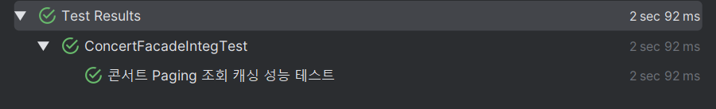
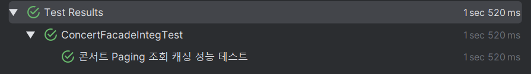

# Caching

## 쿼리분석: 콘서트 조회
콘서트의 메타 정보(제목, 상세 내용)를 조회하는 쿼리.
### Caching이 필요한가?
 - 일반적인 조회에서는 필요하지 않다.
 - **Concert의 양이 매우 많아져서 Paging**이 필요해진다면 필요할 것!
 - 추가로 **주요 Concert, 다가오는 Concert** 등 Concert에 대한 Priority를 부여하거나, 잔여 좌석 조회 등 쿼리가 복잡해진다면 필요해 질 것!

## Caching 전략 수립
1. Eviction vs Expiration: **Expiration**
   - **Eviction**: 콘서트의 정보가 변경될 때마다 콘서트 관련 모든 Cache를 삭제
   - **Expiration**: 특정 주기(ex. 10초)마다 콘서트 정보가 만료됨
   - **콘서트의 경우 Expiration 주기 동안에 발생하는 Data 정합성 문제가 치명적이지 않을 것이라 판단됨**

2. 정말 즉각적인 Update가 필요한 경우는...? **선택적으로 Eviction 처리**
   - 특정 상황에서 치명적 오류 데이터 수정 혹은 좌석 만료 표시 등 즉각적인 데이터 Update가 필요한 경우가 있다.
   - 이럴 때 Caching으로 인해 즉각적으로 정보가 반영되지 않는다면 큰 문제를 야기할 수 있음.
   - **특정 API에서만 Eviction이 일어나도록 설정**

3. Paging에서 데이터 크기 문제
   - Page가 많아질 수록 과하게 많은 데이터가 Cache에 적재될 수 있음
   - 뒤 쪽 페이지일 수록 Hit Rate는 낮아질 것
   - Offset Paging을 이용할 때는 뒤 쪽 페이지일 수록 Caching 효율이 좋음 (뒤 페이지일 수록 SQL 조회 속도가 느려짐)

## Paging: Caching 적용
 - Concert 1000건을 이용하여 100개씩 Offset Paging하도록 설정 후 8페이지에 대해서 100번 조회할 때 성능 비교
 - **Caching 전략**
   - 즉각적인 반영이 중요하지 않아 Expiration 적용
   - ttl의 경우 길 수록 Hit Rate에 유리하지만, Paging 특성상 너무 길어지게 되면 Cache데이터 크기가 너무 커질 수 있음.
   - 10초 ~ 30초로 설정하는 것이 적당하다고 판단하여 20초로 구현
 - 결과
   - Cache X: 2.092초
   - 
   - Cache O: 1.52초
   - 

## 개선해보고 싶은 점
 - Paging에서 Hit Rate가 낮은 Cache에 대해서는 ttl을 낮게 가져가서 페이지 낭비를 줄이는 방법을 생각해보면 좋을 것 같다
   - Ex. Default는 10초 / Hit될 때 마다 갱신하여 최대 30초까지될 수 있게...?
 - Offset Paging이 아니라 Cursor Paging으로 변경하고 앞 페이지 일부에만 Caching을 적용하는 것도 방법이라고 생각된다.
 - 주요 Concert 조회/ 잔여좌석 조회 등 복잡한 쿼리에 대한 결과도 확인하고 싶다.