# DB Indexing을 통한 조회 성능 향상
> ※ 추가 Indexing 효율 테스트를 위해 쿼리 고도화 진행  
> BEFORE: 모든 콘서트 조회
>```java
> concertJpaRepository.findAll(PageRequest.of(page, pageSize))
>```
> AFTER: 예약 가능 콘서트 조회
> ```mysql
> SELECT con.id, con.name, con.description, count(seat.id) AS availableSeat
> FROM concert con
> INNER JOIN concert_schedule sch
>     ON con.id = sch.concert_id
> INNER JOIN concert_seat seat
>     ON sch.id = seat.concert_schedule_id
> WHERE sch.reservation_st_date < CURDATE()
>     AND sch.reservation_end_date > CURDATE()
>     AND seat.reserved = false
> GROUP BY con.id, con.name, con.description
> HAVING count(seat.id) > 0
> ```

### Intro. RDB에서 DB Indexing이란?
#### 특징
 - TABLE의 `특정 Column을 기반으로 조회`시 더욱 빠르게 조회할 수 있도록 도와준다.
 - 데이터 생성/수정/삭제를 할 때는 Indexing을 새로 진행해야 하므로 데이터 CUD 성능은 저하된다. 
 - `Cardinality`가 높은 Column이 `높은 Indexing 효율`을 가진다. (ex. PK - PK는 Default로 Indexing)
   - 필터 후 다시 전체 Column데이터에 Mapping하기 때문에 ( Filtered / 전체 데이터 ) 비율이 높으면 효율이 떨어질 수 있다.
   - 위 특징으로 인해 데이터 분포에 영향을 받는다.

#### 어디에 Indexing을 적용하면 좋은가?
 - 조회가 빈번하게 일어나면서
 - Insert/Update/Delete가 적게 일어나고
 - Cardinality가 높은 값

> - Indexing은 내부 데이터의 분포/형태에 따라서도 많은 영향을 받기 때문에 다양한 요인을 복합적으로 고려해서 설정해야 한다.
> - 보통 User Experience에 CUD 성능보다 READ 성능이 많은 영향을 미치므로, READ 성능을 향상시킬 수 있다면 Indexing을 하는 것을 고려해보아야 한다.

## 1. 쿼리 분석 및 전략 수립
### Query1. 자산 조회
```java
findAndLockByUserId(@NonNull Long userId);
```
- `userId` 단일 Index를 통해 조회 성능을 높일 수 있을 것으로 예상된다.

### Query2. 콘서트 일정 조회
```java
findByConcertId(Long concertId);
```
- `concertId` 단일 Index를 통해 조회 성능을 높일 수 있을 것으로 예상된다.

### Query3. 콘서트 좌석 조회
#### 콘서트 일정에 포함된 모든 좌석 조회
```java
findByConcertScheduleId(Long concertScheduleId);
```
- `concertScheduleId` 단일 Index를 통해 조회 성능을 높일 수 있을 것으로 예상된다.

### Query4. 이용가능한 콘서트 조회
```mysql
   SELECT con.id, con.name, con.description, count(seat.id) AS availableSeat
   FROM concert con
   INNER JOIN concert_schedule sch
       ON con.id = sch.concert_id
   INNER JOIN concert_seat seat
       ON sch.id = seat.concert_schedule_id
   WHERE sch.reservation_st_date < CURDATE()
       AND sch.reservation_end_date > CURDATE()
       AND seat.reserved = false
   GROUP BY con.id, con.name, con.description
   HAVING count(seat.id) > 0
```

- `sch.concert_id`, `seat.concert_schedule_id`, `sch.reservation_st_date`, `sch.reservation_end_date`, `seat.reserved` 등 다양한 Indexing이 가능할 것으로 보임.
- **Indexing 전략**
  - `sch.reservation_st_date`, `sch.reservation_end_date` 둘 다 범위조건에 사용되기 때문에 둘 중 하나를 선택해야 한다.
    - `sch.reservation_st_date < today`에 해당하는 데이터 수는 지속적으로 증가할 것으로 예상 된다.
    - `sch.reservation_end_date`에 Indexing을 하는 것이 비지니스 로직 상 좋아보인다.
  - `seat.reserved`는 Cardinality가 낮기 때문에 `낮은 Indexing 효율`이 예상된다.
  - JOIN에 사용되는 `sch.concert_id`, `seat.concert_schedule_id`는 `단일 Index`로 사용하는 것이 좋아보인다.

### Query5. 예약 조회
#### 만료 예약 조회
```java
findByStatusAndReservedAtBefore(Reservation.ReservationStatus status, Date reservedAt);
```
- `status`, `reservedAt` 두가지를 이용해서 Indexing을 진행해볼 수 있을 것 같다.
- **Indexing 전략**
   - `reservedAt`단일 Index는 높은 Cardinality로 `높은 Indexing 효율`이 예상된다.
   - `status`는 비교적 낮은 Cardinality를 가지므로 `비교적 낮은 Indexing 효율`이 예상된다.
     - 하지만 COMPLETED, EXPIRED 비해 `RESERVED 상태`는 비율이 매우 낮을 것으로 예상되므로 해당 조회 조건에서는 `높은 Indexing 효율`이 예상된다.
   - `(reservedAt, status)` 복합 Index는 reservedAt이 범위검색 이므로 `Status는 FullScan`할 가능성이 높아 보인다.
   - `(status, reservedAt)` 복합 Index가 status로 조회 후 범위검색을 하므로 `가장 높은 Indexing 효율`이 예상 된다.

## 2. 조회 성능 테스트
> 성능 테스트는 `만료 예약 조회`와 `예약 가능 콘서트 조회` 두가지에 대해서만 진행
### Test1. 만료 예약 조회
- **Test 데이터: 1000만개의 Reservation**
  - RESERVED: 180
  - EXPIRED: 4999245
  - COMPLETED: 5000575
  - 랜덤 함수로 `절반 COMPLETED`, 나머지 중 최근 `5분 내 예약은 RESERVED`, `나머지 EXPIRED`

#### Test1.1 Index 없음
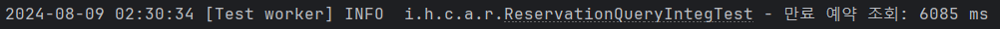
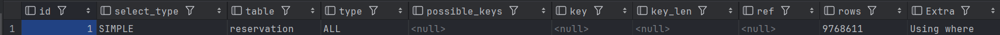
 - Index가 없는 경우 `Extra: Using where`에 `type:ALL`로 조회하며 `6초`가 넘게 걸렸다.

#### Test1.2 단일 Index(reservedAt)
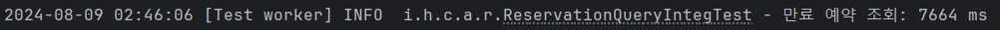
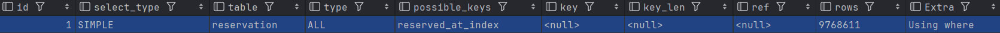
 - reserved_at 자체는 Cardinality가 높지만, `5분이 지난 예약`이라는 조건에 해당하는 예약이 `너무 많아서` Indexing이 사용되지 않았다.
 - 마찬가지로 `Extra: Using where`, `type: ALL`로 `7초`가 넘게 걸렸다.

#### Test1.3 단일 Index(status)
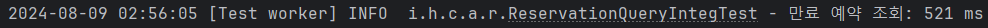
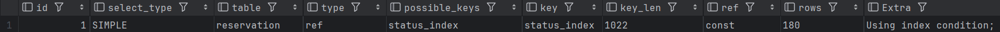
 - status 자체가 Cardinality는 낮지만, `RESERVED`에 해당하는 Column이 `매우 적어서` 높은 Indexing 효율을 보인다.
 - `Extra: Using index condition`, `type: ref`로 `0.5초`만에 조회가 완료 됐다

#### Test1.4 복합 Index(reservedAt, status)
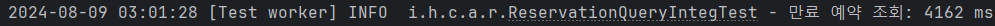
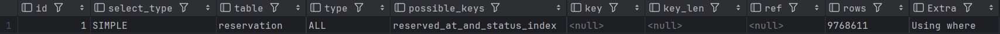
 - 예상대로 `Indexing이 적용되지 않았다`. 단일 Index(reservedAt)과 마찬가지로 `5분이 지난 예약`조건에 해당하는 예약이 너무 많은 것으로 보인다.
 - `Extra: Using where`, `type: ALL`로 `4초`가 걸렸다.
※ Index없는 쿼리간 시간 차이는 컴퓨터 성능 이슈로 보인다.

#### Test1.5 복합 Index(status, reservedAt)
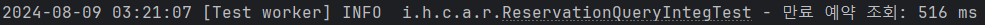
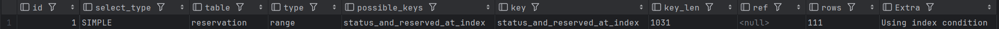
 - `Extra: Using index condition`, `type: range`로 Indexing이 잘 적용되어 `0.5초`가 걸렸다.
 - `단일 Index(status)`와 다르게 `type: range`, `rows: 111`로 검색되는 것으로 보아 reserved_at도 Indexing이 적용된 것으로 보인다.
 - 하지만 RESERVED 자체가 많지않아서 성능향상은 크게 없는 것으로 보인다.

#### 번외. Index(reserved_at)이 적용되지 않은 이유 확인 - `5분 이내 예약 조회`
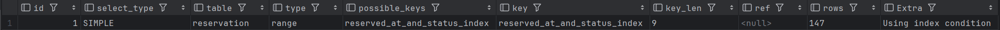
- 예상대로 `5분이상 지난 -> 5분 이내`로 변경하면 `type: range`로 Indexing이 정상적으로 적용되었다.
- `5분이상 지난 예약`은 해당하는 Rows가 너무 많아서 Index가 적용되지 않는 거 같다.

### Test2. 예약 가능 콘서트 조회
- **Test 데이터: 2000만개의 좌석**
  - concert: 1만
  - concert_schedule: 2만 (concert 별 2개) - 1997.01.11 ~ 2024.12.26
  - concert_seat: 2000만 (concert_schedule 별 1000개씩)
    - reserved: 13336495

#### Test2.1 Index 없음
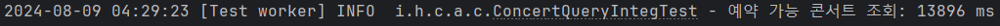
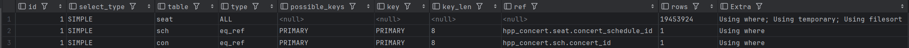
- Index가 없는 경우 `Extra: Using where`에 `type:ALL`로 조회하며 `23초`가 넘게 걸렸다.

#### Test2.2 단일 Index(reservation_st_date) OR 단일 Index(reservation_end_date)
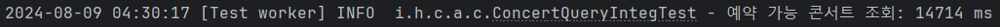
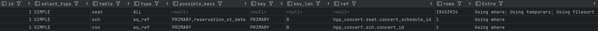
- `Extra: Using where`, `type:ALL`로 Indexing이 적용되지 않은 모습이다.
- Indexing이 적용된 concert_schedule이 아니라 `concert_seat`를 FullScan하고 Join하는 것으로 보인다.
- `단일 Index(reservation_st_date)` / `단일 Index(reservation_end_date)` 둘 다 동일한 현상으로 보였다.

#### Test2.3 단일 Index(reservation_end_date) + 단일 Index(concert_schedule_id)
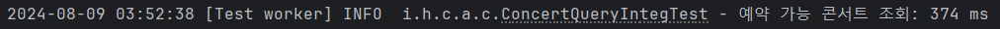
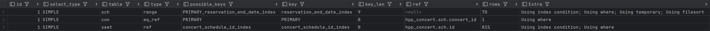
- `JOIN을 위한 index`를 추가해주니 `concert_schedule`에서 Indexing을 한 후 concert_seat를 조회하는 모습이다.
- `0.3초`로 매우 매우 빨라졌다.

#### Test2.3 단일 Index(reservation_st_date) + 단일 Index(concert_schedule_id)
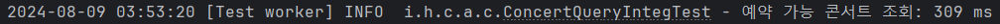
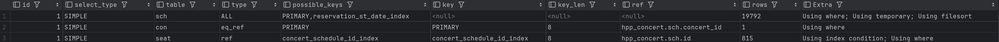
- 예상과는 다르게 reservation_st_date와 reservation_end_date 간 차이는 크게 없었다.
- `rows: 19792`로 위 reservation_end_date에 비해 크게 증가했음에도 쿼리 시간은 오히려 줄었다.
- ※ 70ms는 오차범위 내로 컴퓨터 성능 변화에 따른 차이로 예상된다.

#### Test2.4 단일 Index(reserved)
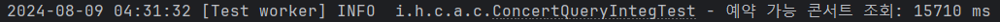
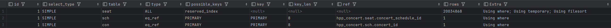
- 예상대로 Cardinality가 낮아서 possible_keys에는 포함되었지만 Indexing은 동작하지 않았다.

#### Test2.5 복합 Index(concert_schedule_id, reserved) + 단일 Index(reservation_end_date)
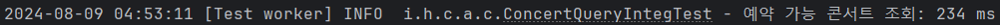
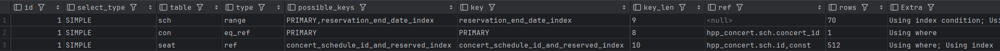
- 두개의 Index모두 정상적으로 적용된 것으로 보인다.
- 또한 3번째줄 `rows:512`로 `단일 Index(reservation_end_date) + 단일 Index(concert_schedule_id)`보다 rows가 줄어든 것으로 봐서 복합 Index 또한 잘 적용된 것 같다.
- 시간 또한 `0.2초`로 오차범위 내로 보이기는 하지만 가장 짧은 시간에 쿼리가 완료됐다.

## 3. Conclusion
### 만료 예약
- 테스트 상으로 `단일 INDEX(status)`와 `복합 INDEX(status, reserved_at)`이 가장 효율이 높았다.
- 테스트 데이터에서는 `5분이 지난 예약 / RESERVED 상태의 예약`의 비율이 높아서 두 INDEX간 차이가 크게 없었을 것으로 예상된다.
- 실제 상황에서는 매초마다 Scheduler가 동작하기 때문에 `5분이 지난 예약`의 비율이 크게 낮을 것으로 예상되므로 `복합 INDEX(status, reserved_at)`가 좋아보인다.
- 성능 향상: 최대 7666ms -> 512ms - 최대 약 `15배` 조회 성능이 빨라졌다.

> 예상과 달랐던 점...
> - status가 Cardinality가 낮고, reserved_at의 cardinality가 높지만 단일 INDEX로 status가 압도적으로 좋은 성능을 보여줬다.
> - Cardinality도 중요하지만 Business 로직 상 Filter될 데이터의 분포를 잘 예측하는 것이 중요해보인다.

### 예약 가능 콘서트 조회
- 테스트 상으로 `복합 Index(concert_schedule_id, reserved) + 단일 Index(reservation_end_date)`가 가장 효율이 높았다.
- 성능 향상: 최대 14714ms -> 234ms - 최대 약 `63배` 조회 성능이 빨라졌다.

> 예상과 달랐던 점...
> - `reservation_st_date`와 `reservation_end_date`에서 filter되는 데이터 수가 꽤 크게 차이가 났음에도 실제 조회 성능은 크게 차이가 없었다.
> - JOIN에 필요한 `concert_schedule_id`가 indexing되어 있지 않으면 상위 Table인 concert_schedule의 Index가 대부분의 상황에서 동작하지 않았다.