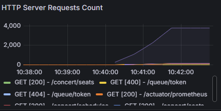
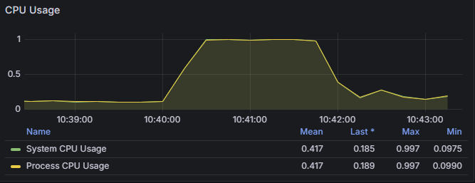
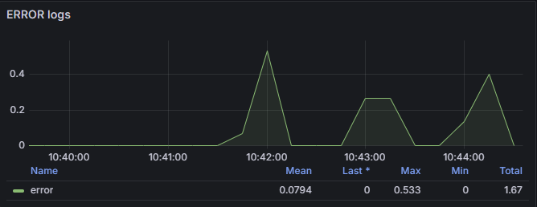
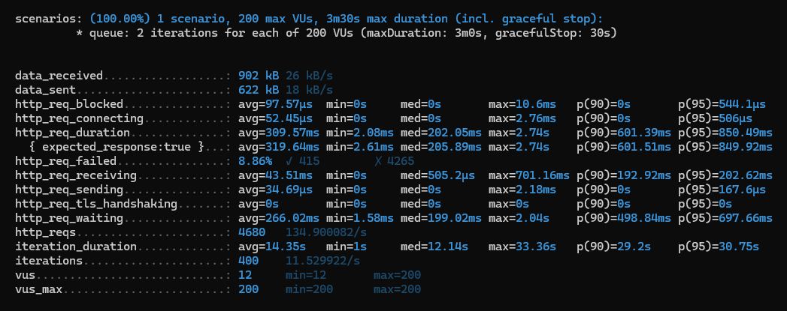
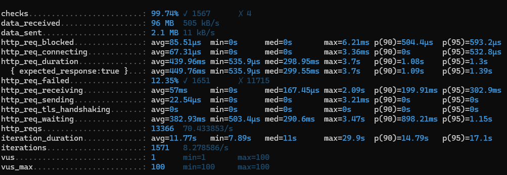
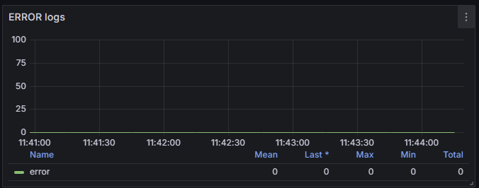

# 장애 대응 보고서
## 장애 발생 상황
순간 트래픽으로 인하여 **많은 오류 발생** 및 **조회 성능 급격하게 하락**

## 장애 분석
- 
- 10:40 급격한 트래픽 발생
- 
- 10:40:30 CPU사용량 최대 도달
- 
- 10:42부터 에러 발생
- 10:43 문제 인지
- 트래픽은 10:43부터 서서히 사라짐

## 원인 분석
1. 오류 발생 원인
    - CPU와 DB 부하로 인한 Timeout (Transaction Thread) 오류
        - logging.level이 DEBUG인 것도 영향이 있을 것으로 보인다.

2. 조회 성능 급격하게 하락
    - 예상보다 많은 인원이 대기열 조회 중
    - 예상보다 많은 인원이 대기열을 통과하여 진입

## 대응 조치
### Short-term 조치 내용
 - Transaction Thread Pool 증가 (10 -> 20)
 - Transaction timeout 시간 증가 (30초 -> 60초)
 - 대기열 통과 인원 감소 (100 -> 50)
 - 대기열 Polling 간격 증가 (1초 -> 2초)
 - 부하테스트 설정 변경 (100 VUS -> 200 VUS)
 - logging.level.root: INFO 설정

### 조치 후 부하 테스트
 - 
 - 대기열 토큰 발급의 경우 `duration 2.1s -> 890ms` 약 2배 속도 향상
 - 
 - 전체 시나리오의 경우 크게 차이가 없는 모습이다.
 - 하지만 ERROR는 더 이상 발생하지 않는다.
 - 

## 재발 방지 대첵
### Long-term 조치
 - 토큰 조회 쿼리 최적화
 - 분산 시스템 구축 및 로드 밸런서 추가
 - CPU 스펙 증가
 - DB서버를 따로 구축
 - 부하 테스트 설계 시 더욱 철저하게 설계하도록 교육