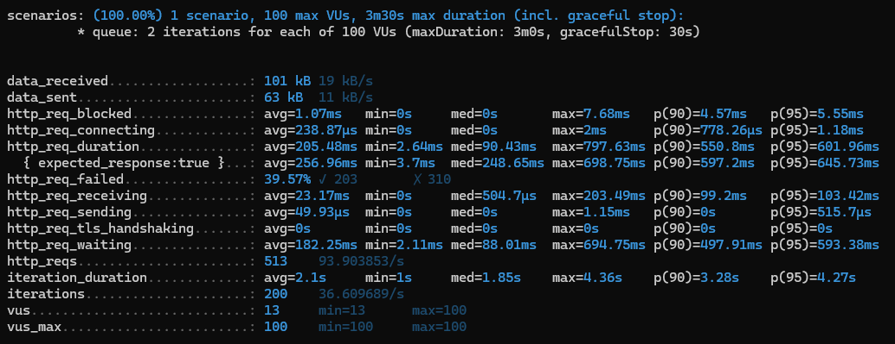
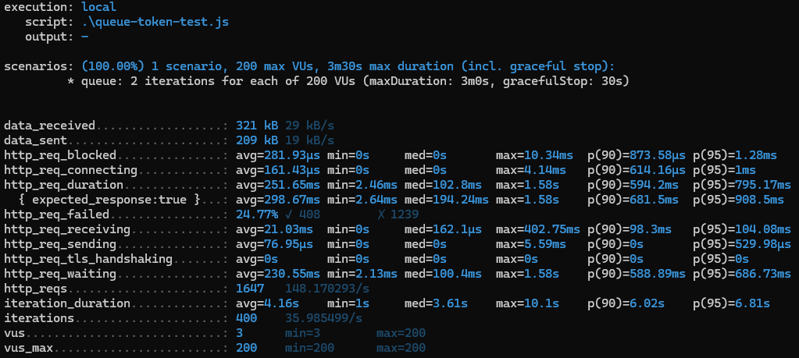
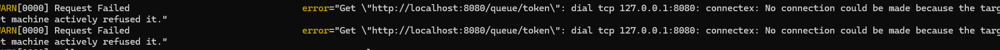
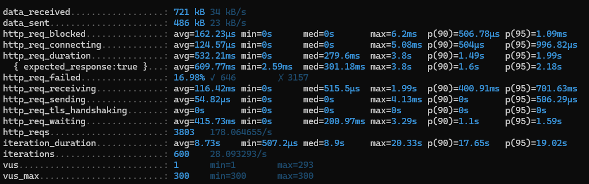
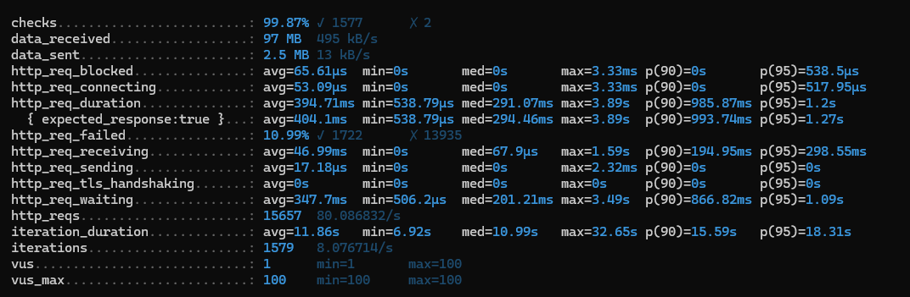
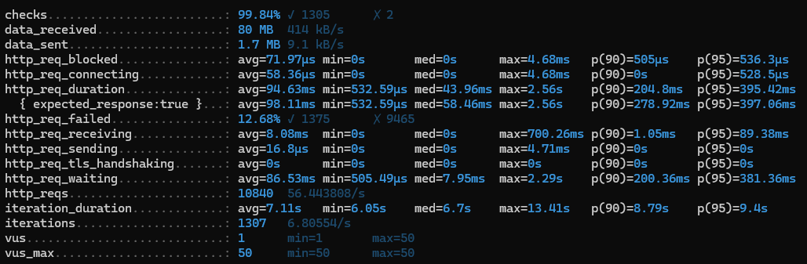

# 부하 테스트
## Intro. 부하 테스트
### Load Test
 - 실제 예상되는 부하 상황에서 `정상 동작함`을 보장하기 위한 테스트이다.
 - 특정 부하 테스트 시나리오에서 정상적인 응답이 오는 지 확인하는 테스트한다.

### Performance Test
 - 특정 부하에서 `일정한 성능`을 보장하기 위한 테스트이다.
 - 특정 부하 테스트 시나리오에서 예상된 성능이 나오는 지 테스트한다.

### Stress Test
 - Application이 최악의 상황에서 견딜 수 있는 `최대 부하`를 확인하기 위한 테스트이다.
 - 부하를 점점 증가시키면서 언제 Application이 정상동작하지 않을 때까지 테스트 한다.

## 1. API 분석
### 1.1 대기열 조회 API
 - **많은 트래픽**이 예상되는 API.
 - 많은 부하를 주어서 많은 트래픽 아래에서도 정상동작하는 지 확인이 필요해 보인다.
### 1.2 콘서트/일정/좌석 조회 + 예약 + 결제
 - 대기열을 통해 컨트롤이 가능한 조회 API.
 - 대기열을 통해 일정한 부하가 지속될 때 정상동작하는 지 확인이 필요해 보인다.
 - 특히 `예약`, `결제` API의 경우 복잡성이 높고, 동시성 이슈, LOCK, 트랜잭션 이슈 등이 발생할 수 있어서 퍼포먼스 또한 확인이 필요하다.

## 2. 시나리오 설정
### Intro. 서버 스펙 설정
- cpu: 1 core
- memory: 2G

```yml 
#docker-compose.yml
services:
  concert-reservation:
    container_name: concert-reservation
    build:
      context: .
      dockerfile: Dockerfile
    environment:
      PROFILE: local-docker
    ports:
      - 8080:8080
    deploy:  
      resources:  
        limits:  
          cpus: '0.25' // 1 core
          memory: '2G'
```

### 1.1 대기열 시나리오
> 대기열 토큰 발급받은 후 해당 토큰이 Activate될 때까지 반복하는 시나리오
> n 명이 한번에 접속하는 상황 (지속적으로 들어오는 상황을 고려해서 iteration 2번 부여)
```js
// queue-token-test.js
export const options = {
  scenarios: {
    queue: {
      executor: 'per-vu-iterations',
      vus: 100,
      iterations: 2,
      maxDuration: '180s'
    }
  }
};

export default function() {
  let token = '';
  while(true) {
    let tokenRes = http.get('http://localhost:8080/queue/token', {
      headers: {
        'TOKEN': token
      }
    });

    let resBody = JSON.parse(tokenRes.body);
    if(resBody.code && resBody.code == '400' && resBody.message == '토큰이 활성화 되었습니다.') break;
    token = resBody.token;
    sleep(1);
  }
}
```
#### 1.1.1 100 VUS

- `p(95)`가 `645.73ms`가 나왔다.
- 토큰 Scheduler가 1초에 1번 100개씩 activate 하도록 되어있지만 `iteration_duration p(95)`가 `4.27s`가 나왔다.
- 부하가 Token Activation Scheduler에도 영향을 주는 것으로 보인다.
- ※ http_req_failed는 TOKEN_ACTIVATED로 인한 오류로 보인다. (1 VUS에서도 http_req_failed가 11%가 나왔다.)

#### 1.1.2 200 VUS

- 부하에 의해서 `duration p(95)`가 `795.17ms`까지 증가했다.
- iteration_durationd이 p(95) 6.81s까지 증가했지만 이는 100개씩 ACTIVATE하는 특성때문인 것으로 보인다.

#### 1.1.1 300 VUS


- 서버에게 refused되었다는 문구와 함께 많은 에러가 발생했고
- `duration p(95) 2.18s`로 매우 처참한 결과가 나왔다.

#### 1.2 콘서트 조회/주문/결제
> 토큰 발급부터 결제까지 모든 과정을 반복하는 시나리오
> 특정 VUS가 2분간 지속적으로 유지되는 상황이다.
```js
// concert-test.js
export const options = {
  scenarios: {
    concert: {
      executor: 'constant-vus',
      vus: 100,
      duration: '120s',
    },
  },
};

export default function() {
  let token = '';
  while(true) {
    let tokenRes = http.get('http://localhost:8080/queue/token', {
      headers: {
        'TOKEN': token
      }
    });

    let resBody = JSON.parse(tokenRes.body);
    if(resBody.code && resBody.code == '400' && resBody.message == '토큰이 활성화 되었습니다.') break;
    token = resBody.token;
    sleep(1);
  }

  
  let concertsRes = http.get('http://localhost:8080/concerts?page=0',{
    headers: {
      'TOKEN': token
    }
  });
  let concert = JSON.parse(concertsRes.body)[0];

  sleep(1);

  let concertScheduleRes = http.get('http://localhost:8080/concert/schedules?concertId=' + concert.id,{
    headers: {
      'TOKEN': token
    }
  });
  let concertSchedule = JSON.parse(concertScheduleRes.body)[randomIntBetween(0, 2)];

  sleep(1);

  let concertSeatRes = http.get('http://localhost:8080/concert/seats?concertScheduleId=' + concertSchedule.id,{
    headers: {
      'TOKEN': token
    }
  });

  let concertSeats = JSON.parse(concertSeatRes.body).filter(seat => !seat.reserved);
  let reservation = null;
  for (let i = 0; i < 1000; i++) {
    sleep(1);

    let selectedSeat = randomItem(concertSeats);
    let reservationRes = http.post('http://localhost:8080/reservations?userId=' + vu.idInTest, 
      JSON.stringify({
        seatIds: [selectedSeat.id]
      }),{
      headers: {
        'Content-Type': 'application/json',
        'TOKEN': token
      }
    });

    let reservationBody = JSON.parse(reservationRes.body);
    if(reservationBody.code && reservationBody.code == '400') continue;
    else {
      reservation = reservationBody;
      break;
    };
  }

  if(reservation == null) return; // 예약 실패 (잔여 좌석 없음 등)

  sleep(1);
  
  let assetChargeRes = http.patch('http://localhost:8080/asset/charge?userId=' + vu.idInTest, 
    JSON.stringify({
      amount: 100000000
    }),{
    headers: {
      'Content-Type': 'application/json'
    }
  });
  sleep(1);

  let paymentRes = http.post('http://localhost:8080/payment?userId=' + vu.idInTest, 
    JSON.stringify({
      reservationId: reservation.reservationId
    }),{
    headers: {
      'Content-Type': 'application/json',
      'TOKEN': token
    }
  });

  check(paymentRes, {
    'Payment Success!': (res) => {
      return JSON.parse(res.body).paidAmount != undefined
    }
  })
}
```

#### 1.2.1 100 VUS

- `median 294.46ms`로 양호한 반면
- `duration p(95): 1.2s`로 굉장히 느린 결과가 나왔다.
- 여러가지의 API가 섞여 있어서 생기는 문제로 보이지만, 특정 API에서 병목현상이 발생하는 것으로 보인다.
- 그러나 check 비율이 99.89%로 꽤 높은 비율을 보여주지만 여전히 `2/1579`의 오류가 발생한 것을 알 수 있다.

### 1.2.1 50 VUS

- `duration p(95): 397.05ms`로 많이 개선된 모습을 보여준다.
- 그러나 여전히 check 비율은 `99.84%`를 보이는 것을 알 수 있다.
- 부하를 줄여 성능을 향상시켜서 `100 VUS: 1579 iterations`에 비해 크게 떨어지지 않는 `1307 iterations`을 확인할 수 있다.

## 결론
### 1.1 대기열 조회
- 현재 상태로는 최대 200개의 Request만 수용이 가능한 것으로 보인다. (Spring max request pool의 영향으로 보인다.)
- 200개가 넘는 요청이 들어올 경우 적절한 조치가 필요할 것으로 보인다. (서버 분산 및 로드 밸런싱 등)

### 1.2 콘서트 조회 로직
- 50 VUS와 100VUS 사이 iteration차이는 크게 나지 않지만 `duration p(95)`에서 큰 차이가 났다.
- 대기열을 50으로 낮추는 것이 장기적으로 더욱 유리해 보인다.